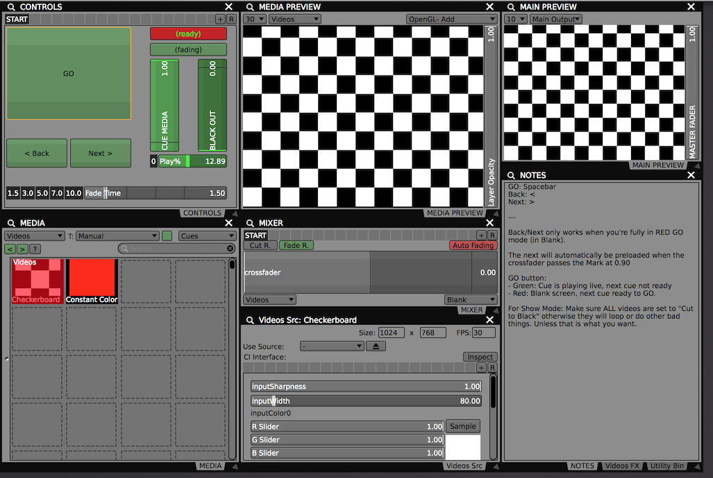
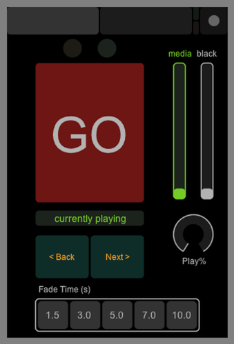

# README

## VDMX Cue Forward - QLab-Esque linear cues project for intermittent video cues

* Space is your GO button.
* Set up your main media bin in your cue order.
* TouchOSC remote control layout included: GO button, load status, playhead position, fade times, fader positions, next/previous cue load buttons

Creative Commons license: CC-BY-SA

---

